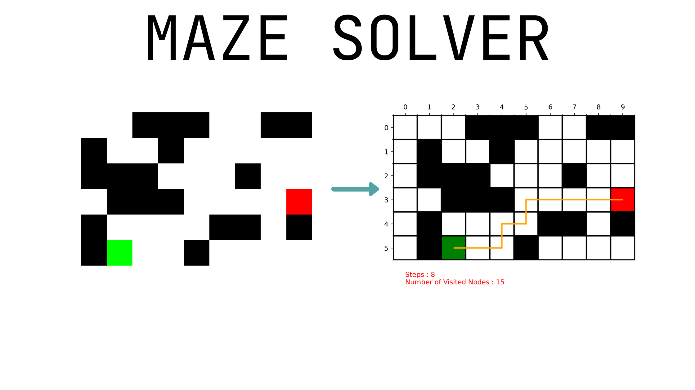

<!---->

<!--
*** Thanks for checking out the Best-README-Template. If you have a suggestion
*** that would make this better, please fork the repo and create a pull request
*** or simply open an issue with the tag "enhancement".
*** Thanks again! Now go create something AMAZING! :D
-->


<!-- PROJECT SHIELDS -->
<!--
*** I'm using markdown "reference style" links for readability.
*** Reference links are enclosed in brackets [ ] instead of parentheses ( ).
*** See the bottom of this document for the declaration of the reference variables
*** for contributors-url, forks-url, etc. This is an optional, concise syntax you may use.
*** https://www.markdownguide.org/basic-syntax/#reference-style-links
-->
[![Contributors][contributors-shield]][contributors-url]
[![Forks][forks-shield]][forks-url]
[![Stargazers][stars-shield]][stars-url]
[![Issues][issues-shield]][issues-url]


<!-- PROJECT LOGO -->
<br />
<p align="center">
  <a href="https://github.com/konmaz/Maze-Solver">
    
  </a>

  <h3 align="center">Solve mazes the easy way</h3>
  
  <p align="center">
    <br />
    ·
    <a href="https://github.com/konmaz/Maze-Solver/issues">Report Bug</a>
    ·
    <a href="https://github.com/konmaz/Maze-Solver/issues">Request Feature</a>
  </p>
</p>


<!-- TABLE OF CONTENTS -->
<details open="open">
  <summary>Table of Contents</summary>
  <ol>
    <li>
      <a href="#about-the-project">About The Project</a>
      <ul>
        <li><a href="#built-with">Built With</a></li>
      </ul>
    </li>
    <li>
      <a href="#getting-started">Getting Started</a>
      <ul>
        <li><a href="#prerequisites">Prerequisites</a></li>
        <li><a href="#installation">Installation</a></li>
      </ul>
    </li>
    <li><a href="#usage">Usage</a></li>
    <li><a href="#roadmap">Roadmap</a></li>
    <li><a href="#contributing">Contributing</a></li>
    <li><a href="#license">License</a></li>
    
  </ol>
</details>


<!-- ABOUT THE PROJECT -->
## About The Project

Introduction.
You can use the above code written in Python to solve a maze.
The algorithm reads the provided image (ex. 'in.png') and returns the solution ('out.png').
The current implementation uses DFS to find a solution -thus the solution will probably not be the best one- but I'm planning to add other implementations like A*, BFS.

### Built With
Python and ♥


<!-- GETTING STARTED -->
## Getting Started

### Prerequisites
Libraries used (can be installed using pip)

* Matplotlib
* PIL
* numpy

### Usage
 # TODO
<!--
1. Get a free API Key at [https://example.com](https://example.com)
2. Clone the repo
   ```sh
   git clone https://github.com/your_username_/Project-Name.git
   ```
3. Install NPM packages
   ```sh
   npm install
   ```
4. Enter your API in `config.js`
   ```JS
   const API_KEY = 'ENTER YOUR API';
   ```


<!-- USAGE EXAMPLES -->
## Usage

Use this space to show useful examples of how a project can be used. Additional screenshots, code examples and demos work well in this space. You may also link to more resources.

_For more examples, please refer to the [Documentation](https://example.com)_


<!-- ROADMAP -->
## Roadmap

See the [open issues](https://github.com/konmaz/Maze-Solver/issues) for a list of proposed features (and known issues).


<!-- CONTRIBUTING -->
## Contributing

Contributions are what make the open source community such an amazing place to be learn, inspire, and create. Any contributions you make are **greatly appreciated**.

1. Fork the Project
2. Create your Feature Branch (`git checkout -b feature/AmazingFeature`)
3. Commit your Changes (`git commit -m 'Add some AmazingFeature'`)
4. Push to the Branch (`git push origin feature/AmazingFeature`)
5. Open a Pull Request


<!-- LICENSE -->
## License
# TODO!
Distributed under the MIT License. See `LICENSE` for more information.


<!-- MARKDOWN LINKS & IMAGES -->
<!-- https://www.markdownguide.org/basic-syntax/#reference-style-links -->
[contributors-shield]: https://img.shields.io/github/contributors/konmaz/Maze-Solver.svg?style=for-the-badge
[contributors-url]: https://github.com/konmaz/Maze-Solver/graphs/contributors
[forks-shield]: https://img.shields.io/github/forks/konmaz/Maze-Solver.svg?style=for-the-badge
[forks-url]: https://github.com/konmaz/Maze-Solver/network/members
[stars-shield]: https://img.shields.io/github/stars/konmaz/Maze-Solver.svg?style=for-the-badge
[stars-url]: https://github.com/konmaz/Maze-Solver/stargazers
[issues-shield]: https://img.shields.io/github/issues/konmaz/Maze-Solver.svg?style=for-the-badge
[issues-url]: https://github.com/konmaz/Maze-Solver/issues


